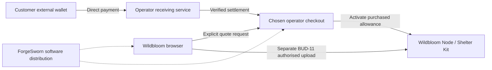

# Paid storage design and implementation plan

Status: source integration implemented, 7 October 2026. The browser and opt-in
Node checkout now support Lightning and exact-value LNURLcash with durable quotes,
private recovery references and paid encrypted uploads. See the current
[service guide and evidence](NODE-SERVICES.md). Synthetic acceptance is not live
wallet/mint acceptance, deployed sales, legal classification or a library audit.

## Implementation evidence

Shelter Kit 0.5.0 contains a `paid` module
and schema-6 migration, documented in its `PAID-STORAGE.md`:

- Bounded durable sale holds, immutable storage terms and atomic, idempotent
  activation/renewal; no wallet credentials or settlement assertions in the core.
- Full capacity commitments enforced against later sales, owner writes and
  quota reductions, with conservative accounting for shared non-paid copies.
- Paid logical byte limits, expiry, protected recovery grace and claim-aware
  collection, including restart and concurrent reservations.
- Existing BUD-authorised upload/preflight/mirror integration and private
  signer listing; no new payment header, checkout route or Nostr kind.

The initial core permits one stable allowance per signer. Renewal preserves
its signer and byte ceiling; capacity upgrades and transfers are not supported.
New sales require available capacity and do not automatically evict guests.
These are deliberate initial limits, not a completed checkout product.

The storage core is delivered as the Shelter Kit `v0.5.0` GitHub prerelease.
Wildbloom Node source integration updates its dependency pin separately;
published desktop installers are not upgraded by this browser deployment.
Local validation passed: 101 Shelter tests, 46 Node compatibility tests,
formatting/lint, the browser production build and fresh-browser recovery from a
restarted Node replica. The real-Tor test was not run. Browser recovery validates
the existing file journey against the changed core, not payment checkout.

The operator checkout and browser journey are now implemented. Cashu, on-chain
Bitcoin and Monero remain future rails. Automated bandwidth metering is absent:
delivery terms are operator-managed. Live receiving credentials, actual-service
acceptance, paired backup/restore and direct refund operations remain operator
launch gates.

## Product decision

Wildbloom will let a customer buy a defined storage service directly from a
chosen node operator. ForgeSworn supplies the software. Each operator owns its
checkout, receiving wallet, accepted issuers, pricing, records and obligations
to its customers. LNURLcash is a first-class integration target: ForgeSworn
co-authors the protocol and maintains relevant implementations.

The initial product is a non-transferable capacity allowance on one named
node for a fixed term, not a general-purpose monetary balance. For example:
10 GiB of encrypted bytes for 30 days, with explicitly stated delivery limits.
Renewal is a separate purchase. Independently sold replicas require separate
operator quotes and payments. A receipt proves a purchase, not future custody.

ForgeSworn may separately sell its own software, support or storage. In that
case its role as the seller must be explicit; software-provider terms cannot
describe a ForgeSworn-operated node as somebody else's service.

## Funds and control boundary

- No ForgeSworn collection account, pooled wallet, escrow, onward payouts or
  transaction fee deduction from operator receipts.
- No customer wallet balance, cash-out feature, transferable storage token or
  cross-operator credit in Wildbloom.
- No hosted ForgeSworn bearer-note redemption proxy. Cashu and LNURLcash
  acceptance happens at the selling operator's endpoint, for its own sale.
- No mint, exchange, currency conversion or wallet funding service in
  Wildbloom. Customers use their external wallets for those operations.
- Refunds are payments from the seller's own funds, handled by that seller.
  Avoiding a cash-out balance does not remove statutory refund rights.
- ForgeSworn must not possess credentials that can spend operator or customer
  funds. Operator payment secrets remain outside the browser and storage core.

This boundary concerns actual deployment and control, not the name of a
library or the presence of a non-custodial label.

## Existing ForgeSworn components

These are local source observations, not claims about package publication or
deployed versions. The inspected library checkouts were clean. Pin and review
exact dependencies when implementing; these hashes are an evidence snapshot.

| Component | Inspected commit | Intended role and gap |
| --- | --- | --- |
| [farrier-kit](https://github.com/forgesworn/farrier-kit) | `580fb39` | Browser invoice, amount, expiry and preimage verification. Use pure primitives first; network helpers need the Wildbloom transport policy. |
| [lnurlcash-kit](https://github.com/lnurlcash/lnurlcash-kit) | `8656ac2` | TypeScript note parsing and protocol support; reuse the existing implementation rather than recreate note semantics. |
| [lnurlcash-core](https://github.com/lnurlcash/lnurlcash-core) | `adc9c47` | Rust protocol operations with caller-controlled I/O. Persist replacement secrets before sending mutations in the operator's receiving service. |
| [toll-booth](https://github.com/forgesworn/toll-booth) | `53dc0f5` | TypeScript Lightning, Cashu and LNURLcash adapters; useful operator-side integration and behaviour reference. Generic request credits are not the storage entitlement model. |
| [toll-booth-rs](https://github.com/forgesworn/toll-booth-rs) | `acd8b14` | Rust payment middleware foundation. Current rail implementation is Lightning; Cashu and LNURLcash parity is work, not an existing capability. |
| [payment-methods](https://github.com/forgesworn/payment-methods) | `50ba1a4` | Proposed payment methods, schemas and interoperability references; not final IETF/IANA standards. |
| [Shelter Kit](https://github.com/forgesworn/shelter-kit) | Initial Node inspection: `v0.4.1` | Shared claims, quota and admission core. Paid retention and durable entitlements belong here; operator payment adapters belong outside it. |

Bitcoin on-chain and Monero need separate operator-owned settlement adapters.
No suitable ForgeSworn adapter for those two methods was established in this
inspection. Do not silently replace the ForgeSworn stack with a central
third-party processor. An operator may configure its own payment infrastructure.

`nwc-kit` is not part of the initial browser integration. A NWC connection
carries spending authority and a connection secret, conflicting with the
current no-raw-private-key boundary. Display invoices and hand off to external
wallets without importing wallet credentials. Co-authoring a protocol does not
change that boundary.

## Payment methods

| Method | Acceptance at the selling operator | Required evidence |
| --- | --- | --- |
| Lightning | Operator-issued invoice, paid by an external wallet | Bind exact invoice, amount, network, expiry and payment hash to one order; verify settlement and issue one allowance. |
| LNURLcash | Receive a note directly and rotate it into operator ownership | Approved issuer, authoritative amount, durable replacement secret, successful rotation and reconciliation of ambiguous outcomes. An offline certificate alone does not prove unspent value. |
| Cashu | Receive tokens directly and swap at an approved mint | Correct unit and amount after fees, successful swap, durable recovery state and replay refusal. Token parsing or a state check alone is insufficient. |
| Bitcoin on-chain | Operator-generated destination matched to one order | Independently observed amount, configured confirmations, reorganisation handling and explicit late/partial/overpayment policy. |
| Monero | Operator-generated subaddress matched to one order | Operator wallet service observes incoming amount, confirmations and locked status; a customer-supplied transaction ID is insufficient. |

Exact-amount bearer payments are the initial interface. Unsupported overpayment
must be refused before a destructive redemption wherever determinable. Any
unexpected accepted surplus follows a seller refund process; it must not
silently create a monetary balance. Unknown payment outcomes block repeat
spending until reconciled against the original order.

## Blossom compatibility

[BUD-06](https://github.com/hzrd149/blossom/blob/master/buds/06.md) supports an
upload preflight. [BUD-07](https://github.com/hzrd149/blossom/blob/master/buds/07.md)
is a draft optional payment mechanism using `402`, `X-Lightning` and `X-Cashu`.
[NUT-24](https://cashubtc.github.io/nuts/24/) defines Cashu HTTP payments.

The first integration uses a separate, versioned operator checkout to purchase
an allowance; ordinary BUD-11 uploads then consume storage capacity. This keeps
payment credentials separate from Blossom's `Authorization: Nostr` header.
Do not place generic L402/Payment middleware in front of uploads in a way that
replaces or bypasses Nostr authorisation.

Direct BUD-07 negotiation is a later interoperability increment. In the
inspected TypeScript `xcashu-rail.ts`, the `creqA` encoder uses simplified JSON
instead of the standard encoding. Resolve this upstream and pass independent
vectors before claiming NUT-18/NUT-24 or BUD-07 compatibility. LNURLcash's
`X-LNURLcash` format is an extension: publish and test its versioned contract,
and do not describe it as a standard Blossom payment method.

Checkout orders, allowances and authentication also need a reviewed wire
contract before implementation. Reuse applicable published authentication;
do not invent a Nostr kind or broaden BUD-11 to cover arbitrary checkout JSON.

## Storage contract and state

The operator's immutable quote must bind the offer version, operator identity,
node origin, customer public key, capacity in ciphertext bytes, duration,
activation deadline, delivery allowance and limits, price/unit/payment method,
quote expiry, retention policy, grace period, and refund terms. The browser
must visibly identify the seller. A change requires a new quote and consent.

The initial allowance binds to the customer's existing external Nostr signer.
It is private to the operator, not published in the file event. This links
that customer's payments and claims at that operator; do not claim anonymity.

Conceptual records, not a committed database or wire schema:

- Order: immutable quote, settlement reference, state and reconciliation data.
- Allowance: order ID, node, signer public key, byte ceiling, start/end times,
  retention-policy version and delivery policy.
- Claim: existing hash/signer claim plus the allowance authorising retention.
- Reservation: logical bytes and physical capacity reserved atomically.

The order lifecycle is `quoted -> awaiting payment -> payment pending ->
settled -> active`. Expired quotes and definitively failed payments are
separate outcomes. `settled but not active` is durable and recoverable: retry
activation exactly once or route to seller refund handling. A timeout or
browser cancellation cannot be treated as proof that payment failed.

Reserve sale capacity for the quote's bounded lifetime before offering payment;
account for every unexpired sold allowance when admitting later sales and
owner writes. Slow-chain payments received after the hold expires must not
oversell capacity: fulfil only if still possible, otherwise use the disclosed
seller refund policy. The storage term starts on successful activation.

Paid claims require an explicit protected retention contract in Shelter Kit.
Do not promote guest claims merely because an admission fee was paid, or reuse
a revocable friend grant while promising stronger terms. Capacity pressure
must reject new work rather than evict an active paid claim. Operator removal
for policy/legal reasons remains possible and must have explicit terms.

Physical deduplicated bytes count once; each customer's claims consume their
full logical size. Expiring one allowance must not delete another customer's
active copy. Stop new writes at expiry; preserve recovery for the disclosed
grace period before making expired claims eligible for collection. Renewal
must be atomic with expiry handling and survive restart.

Paid storage does not increase the browser's current 256 MiB per-file limit.
Download limits apply at the operator's serving boundary. Version one does
not sell unlimited egress or require payment on every GET; published URLs and
torrent web seeds otherwise make costs and recovery difficult to predict.

## Consent, privacy and recovery

- No offer lookup, quote request, payment-status polling or issuer contact on
  page load. Each network stage begins with a distinct user action; bounded
  polling may run only within a disclosed active status-check operation.
- Payment never starts upload, relay publication or seeding automatically.
- Changes to file, profile or endpoints invalidate prior network consent and
  stale asynchronous UI results. They do not erase an already settled order.
- No recovery key, filename or plaintext hash reaches checkout. Never publish
  payment references, note secrets, invoices or receipts in Nostr file events.
- Keep bearer notes out of URLs served by Wildbloom, analytics, logs, error
  text and browser storage. Prefer wallet-to-operator transfer. If browser
  relay is needed, explicitly review its transient possession and transport.
- Operator mutation recovery secrets are payment assets, stored only in its
  receiving service. Storage-core records contain no spending credentials.
- Tor-only mode accepts only approved checksum-valid onion endpoints and has
  no clearnet redirects, discovery or fallback. Disable a payment method if
  its required application endpoints cannot meet this policy. External wallet
  transport is separate and must not be advertised as verified Tor-only.
- Allow a private receipt export and a separately authorised order-status
  recovery journey without persistent browser state. Do not export bearer
  payment secrets as receipts. Design receipt authentication before shipping.
- Payment proves neither storage nor replication. Verify uploaded bytes and
  each purchased replica independently; retain timestamps and scope in evidence.

## UK regulatory review brief

The target is software provision and direct merchant acceptance. This is an
architectural objective, not a finding that ForgeSworn or an operator is outside
regulation. UK analysis must consider payment services, e-money and cryptoasset
activities rather than rely on the phrase "money transmitter".

The FCA's [current registration scope](https://www.fca.org.uk/firms/cryptoassets/who-needs-register)
includes arranging cryptoasset exchanges and safeguarding customer assets or
keys. Non-custody alone does not settle whether activities are in scope.
Its [payment-service definition](https://handbook.fca.org.uk/glossary/G2617)
contains a conditional technical-provider exclusion which does not cover
payment initiation or account information services. Application depends on the
actual assets and activities. The FCA currently states that the new
cryptoasset regime begins on 25 October 2027; review against the launch date.
Sources checked on 4 October 2026; recheck before launch.

Give UK counsel the actual deployment and control diagram, seller contracts,
credential ownership, note-redemption flow, refund procedure and revenue
model. Ask for assessment of:

1. ForgeSworn software distribution and hosted browser responsibilities,
   separately from any ForgeSworn-operated storage business.
2. Direct receipt and rotation/swap of LNURLcash/Cashu for a merchant's own
   services, including issuer classification and any exchange/arranging issue.
3. The proposed non-transferable storage allowance and statutory consumer
   rights; do not claim a limited-network exemption without analysis.
4. External-wallet handoff, any browser possession of bearer instruments, and
   whether the proposed service goes beyond technical assistance.
5. Current and forthcoming cryptoasset rules, and product wording that offers
   storage without making unreviewed cryptoasset financial promotions.

No automatic exemptions, "zero KYC" promises or liability disclaimers should
be copied from library marketing. Operator obligations require their own
assessment. Legal review is a launch gate; it need not block local engineering.

## Sequenced implementation and acceptance

| Step | Work and repository | Completion evidence |
| --- | --- | --- |
| 1 | Shelter Kit: paid allowances, capacity commitments, claims, expiry and migration | Concurrent reservations, deduplication, full pool, renewal, restart, grace period and other-claim preservation tests; Node consumption pinned to reviewed release. |
| 2 | ForgeSworn payment libraries: operator checkout contract and durable order state; Lightning and LNURLcash first-class paths | Wrong invoice/amount/issuer, replay, lost response, duplicate settlement, crash before activation, late payment and refund routing. Resolve authentication and exact-amount semantics. |
| 3 | Wildbloom Node: operator-owned adapter and entitlement activation | Payment credentials isolated from storage core; no ForgeSworn backend dependency; authenticated callbacks or bounded reconciliation; exactly-once activation after crash. |
| 4 | Browser: farrier-kit validation, quote display, external-wallet handoff, receipt and explicit upload | Zero load-time network, consent cancellation, stale results, hostile quote strings/URLs, no wallet keys, no payment metadata publication or persistent browser secrets. |
| 5 | Cashu and Blossom interoperability in shared libraries | Standard encodings and independent vectors, mint failure and spent-token rejection, no duplicate credit, BUD-11 preserved alongside payment proofs. |
| 6 | Bitcoin on-chain and Monero operator adapters | Controlled chain/wallet tests for confirmations, reorganisation, partial/late/overpayment, locked outputs and restart reconciliation. |
| 7 | Paid storage acceptance and release | Fresh-browser receipt recovery, exact paid upload/download, replica failure, node restart, Tor-only refusal, platform checks, operator terms and UK review. |

LNURLcash integration remains pinned to a reviewed draft revision with
conformance evidence; its draft status is not a reason to defer it behind all
other payment methods. The storage core is a prerelease; this browser's runtime still has no payment
behaviour.
